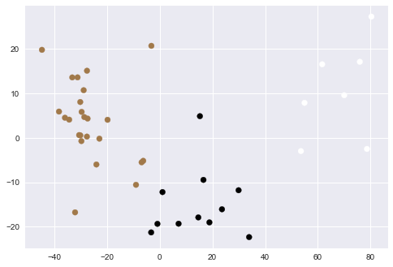

# LyonParkingAnalysis
Personal machine learning/data mining project using open data of parking lots in the city of Lyon, France. The goal is to find patterns between different parking lots in the city, to find parameters that can affect their behaviour and to learn about the habits of people in Lyon.

After finishing an Android application during the academic year of 2016-2017 at my University, I was too curious not to use the data obtained for some amazing project. All data was collected from https://data.grandlyon.com/, an open-data plataform of the Grand Lyon metropole which aims to encourage citizen participation in the development of the city and in the creation of new services. The methodology applied here was based on [Jake VanderPlas' analysis of Seattle Work Habits](http://jakevdp.github.io/blog/2015/07/23/learning-seattles-work-habits-from-bicycle-counts/).

The data was stored in a SQL and here we will be using Machine Learning methods from scikit-learn library to visualize and classify the parking lots.

## Clustering the parkings
After applying a Principal Component Analysis (PCA) on the data, we obtain a 2D projection of the data. Each dot is relative to a parking.

<figure>
  
  <figcaption>Fig1. Mean of the peak hours for the parkings of the three clusters.</figcaption>
</figure>

## Analysis

<figure>
  
  <figcaption>Fig1. Mean of the peak hours for the parkings of the three clusters.</figcaption>
</figure>

<figure>
  
  <figcaption>Fig1. Mean of the peak hours for the parkings of the three clusters.</figcaption>
</figure>

